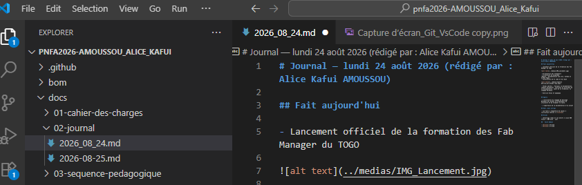

# Journal — lundi 24 Août 2026 (rédigé par : Alice Kafui AMOUSSOU)

## Fait aujourd'hui

- Lancement officiel de la formation des Fab Manager du TOGO

- Présentation des formateurs
- Présentaion du programme
-Module : Documentation avec Git, GitHub et GitHub Pages.
- Installation de Vs code et Git bash 

- Thèmes abordés : Pourquoi la documentation, comment documenter, fonctions et principes de la documentation, cadre de la formation, le langage Markdown.

- Exercice Essai et Pratique

## Appris

- L'utilisation du langage de balisage Markdown qui permet principalement de structurer et de formater le texte.

- L'importance de la documentation d'un projet

## Raté, puis corrigé

- Aucune difficulté rencontrée sur ce premier module.

## Décidé

- Journal du jour à envoyer sur GitHub
- Pratiquer afin de maitriser les syntaxes du langage Markdown.

## À faire demain

- Initialisation de Git — Prénom
- Création du repository sur GitHub — Prénom
- Envoi du journal dans le repository — Prénom